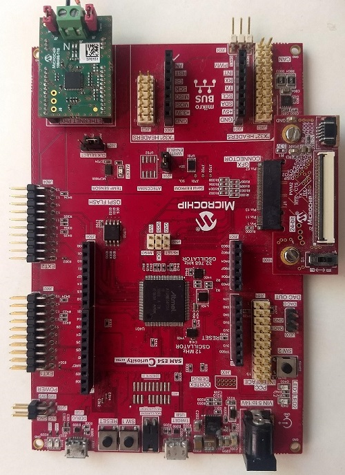
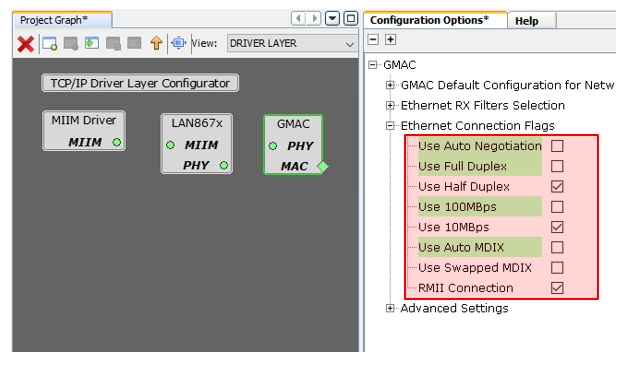

# 10BASE-T1S TCP/IP application with Iperf support

The example showcases, how to configure LAN867x ethernet phy in Harmony 3 and establish a network. It also contains example about, how to access and modify the register of LAN867x from user code space.

## Development kits
The following table provides details of the hardware used for the example.

| Development Kit |
|:---------|
|[Sam E54 Curiosity Ultra](https://www.microchip.com/Developmenttools/ProductDetails/DM320210) |
|LAN867x RMII board|

## Harmony 3 Setting for LAN867x
### GMAC Setting
To use the LAN867x Ethernet PHY, configure the GMAC to operate in 10BASE-T1S setting
* 10 Mbps
* Half Duplex
* Auto Negotiation - Disabled
* MDIX - Disabled

### PLCA Setting
10BASE-T1S can be used in PLCA or CSMA/CD mode.
In PLCA mode, kindly set Node Id and Node Count.

