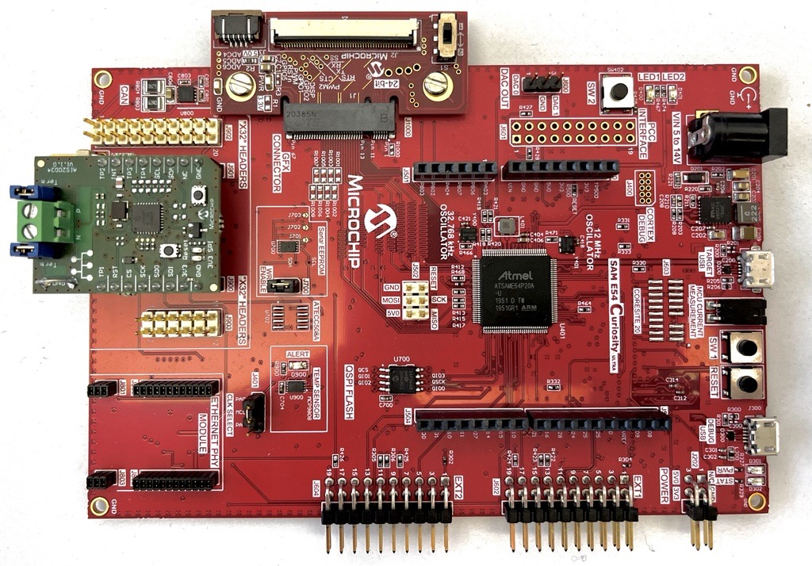
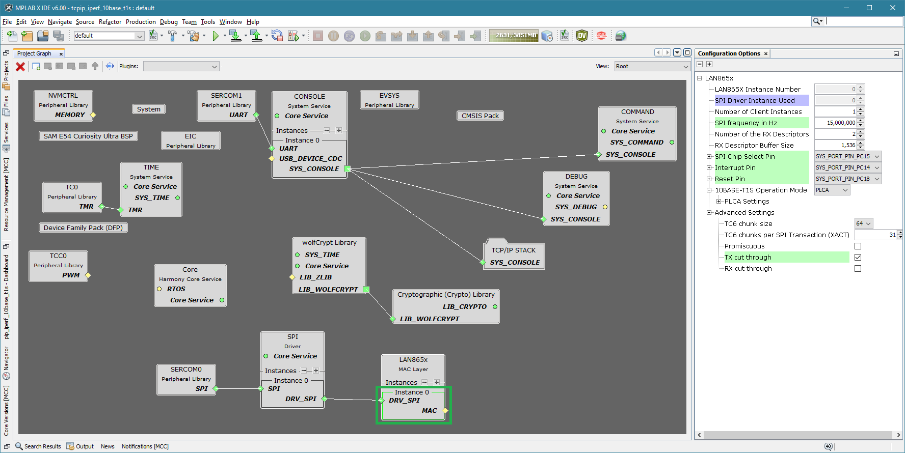

# TCP/IP Client using the LAN865x 10BASE-T1S Ethernet MAC-PHY

This example shows how to configure the LAN865x to be used in a 10BASE-T1S Multi-Drop
Ethernet network in either PLCA and CSMA/CD mode. It also shows how to r/w registers
of the LAN865x during normal operation.
Additionally, common Ethernet network functionalities are supported, e.g. ping and iperf.

## Building The Application
The parent folder for all the MPLAB X IDE projects for this application is given below:

**Application Path** : net_10base_t1s\apps\tcpip_iperf_lan865x\firmware

To build the application, refer to the table below and open the appropriate project file
in MPLABX IDE.

| Project Name              | Description                                               |
| ---                       | ---                                                       |
| tcpip_iperf_10base_t1s.X  | TCP/IP Client using the LAN865x 10BASE-T1S Ethernet MAC-PHY   |
| tcpip_iperf_10base_t1s_freertos.X  | TCP/IP Client using the LAN865x 10BASE-T1S Ethernet MAC-PHY in FreeRTOS environment  |

## Hardware setup

* Hardware used
    * [Sam E54 Curiosity Ultra](https://www.microchip.com/Developmenttools/ProductDetails/DM320210)
    * [SPI to 10BASE-T1S interface card](https://www.microchip.com/en-us/development-tool/TODO_REPLACE_LINK)
* Hardware setup
    * Connect the DEBUG USB port on the board to the computer using a micro USB cable
    * Connect the SPI to 10BASE-T1S interface card to another 10BASE-T1S node (e.g. a second instance of this setup)

## Harmony 3 Settings for LAN857x

Configuration is done via the "MPLAB(c)  Code Configurator". Start the corresponding tool via the menu "Tools" and "Embedded". 

**MAC-PHY Settings**
The LAN865x MAC-PHY settings are available by clicking the corresponding building block in the "Root"-view.

**PLCA Settings**

10BASE-T1S can be used in PLCA or CSMA/CD mode.
When using PLCA, the parameters for _Local Node ID_, _Node Count_,
_Max Burst Count_ and _Burst Timer_ must be configured.
These settings are stored in a subsection inside the MAC-PHY settings.

## Running the Application

1. Open a Terminal application (e.g. Tera term) on the computer
2. Connect to the Virtual COM port and configure the serial settings as follows:
    * Baud : 115200
    * Data : 8 Bits
    * Parity : None
    * Stop : 1 Bit
    * Flow Control : None
3. Build and Program the application using the MPLAB X IDE
	For optimum results, select "Release" Mode as build target, this requires fee-based XC32 compiler license.
4. See the messages in the console
5. Type 'help' for getting a list of available commands

