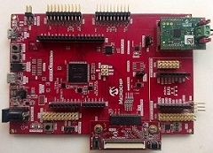
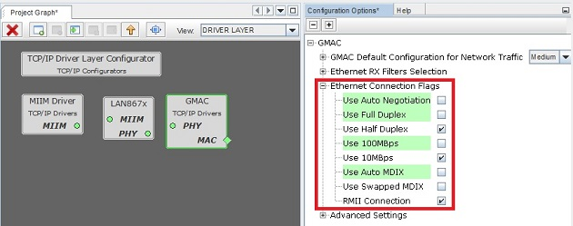
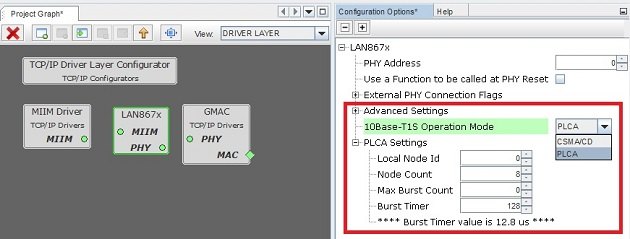
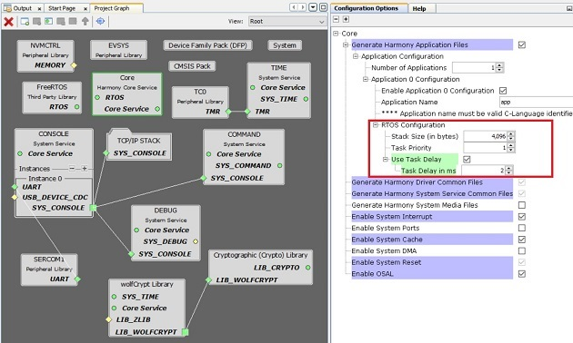
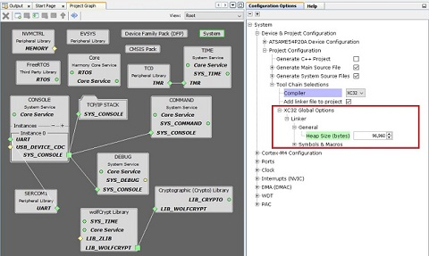

# TCP/IP Client using the LAN867x 10BASE-T1S Ethernet PHY

This example shows how to configure the LAN867x to be used in a 10BASE-T1S Multi-Drop
Ethernet network in either PLCA and CSMA/CD mode. It also shows how to r/w registers
of the LAN867x during normal operation.
Additionally, common Ethernet network functionalites are supported, e.g. ping and iperf.

## Building The Application
The parent folder for all the MPLAB X IDE projects for this application is given below:

**Application Path** : net_10base_t1s\apps\tcpip_iperf_10base_t1s\firmware

To build the application, refer to the table below and open the appropriate project file
in MPLABX IDE.

| Project Name              | Description                                               |
| ---                       | ---                                                       |
| tcpip_iperf_10base_t1s.X  | TCP/IP Client using the LAN867x 10BASE-T1S Ethernet PHY   |
| tcpip_iperf_10base_t1s_freertos.X  | TCP/IP Client using the LAN867x 10BASE-T1S Ethernet PHY in FreeRTOS environment  |

## Hardware setup

* Hardware used
    * [Sam E54 Curiosity Ultra](https://www.microchip.com/Developmenttools/ProductDetails/DM320210)
    * [RMII to 10BASE-T1S interface card](https://www.microchip.com/en-us/development-tool/EV06P90A)
* Hardware setup
    * Connect the DEBUG USB port on the board to the computer using a micro USB cable
    * Connect the RMII to 10BASE-T1S interface card to another 10BASE-T1S node (e.g. a second
      instance of this setup)

## Harmony 3 Settings for LAN867x
**GMAC Settings**

10BASE-T1S is a 10 Mbps, half-duplex network.
Therefore, the GMAC must be configured accordingly to:
* 10 Mbps
* Half Duplex
* Auto Negotiation - Disabled
* MDIX - Disabled

**PLCA Settings**

10BASE-T1S can be used in PLCA or CSMA/CD mode.
When using PLCA, the parameters for _Local Node ID_, _Node Count_,
_Max Burst Count_ and _Burst Timer_ must be configured.

## Harmony 3 Settings for FreeRTOS

**Note:** The following settings applicable only for FreeRTOS application. For Bare Metal application, the below settings are not required.

**SERCOM Settings**

Set the SERCOM RX and TX buffer size as 4096.

**CORE Settings**

According to the application update the Task delay field.

**SYSTEM Settings**

In the System configuration update the heap size as 96960 bytes (based on the application). 

**SYSTEM COMMAND Settings**

In SYSTEM COMMAND configure the required stack size for the application. In this case 10240 bytes.

## Running the Application

1. Open a Terminal application (e.g. Tera term) on the computer
2. Connect to the Virtual COM port and configure the serial settings as follows:
    * Baud : 115200
    * Data : 8 Bits
    * Parity : None
    * Stop : 1 Bit
    * Flow Control : None
3. Build and Program the application using the MPLAB X IDE
4. See the messages in the console
